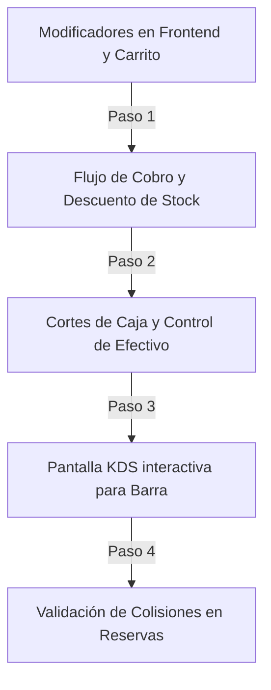

# Auditoría de Requisitos: Implementación en Café Parisien

Esta auditoría evalúa el estado del código y esquema actual del proyecto **Café Parisien** en Laravel contra los 15 módulos y 4,500 casos de uso detallados en las especificaciones de requisitos, determinando qué elementos deben ser prioridad de desarrollo.

---

## Diagnóstico del Estado Actual del Proyecto

Al analizar la estructura de modelos y controladores del proyecto, se observa una particularidad de diseño sumamente interesante:
> [!NOTE]
> **La base de datos ya está sobrediseñada**: El esquema cuenta con 31 tablas que cubren casi todos los aspectos de la operación (turnos, reservaciones, auditoría, modificadores, facturas).
> **Falta la lógica de negocio y UX**: La mayoría de estas tablas solo se pueden gestionar de manera "cruda" a través del CRUD dinámico en el panel de administración. Falta la automatización en el backend y las interfaces de usuario (front-end) amigables.

---

## Análisis de Prioridad de Implementación de Casos de Uso

A continuación se detallan cuáles de los casos de uso documentados deben implementarse obligatoriamente, organizados por su urgencia operativa y viabilidad técnica.

### 🚨 PRIORIDAD 1: CRÍTICOS (Deberían implementarse de inmediato)

#### A. Integración de Modificadores en el Checkout (Módulos 2, 6 y 12)
* **Estado Actual**: Existen las tablas `tiposmodificador` y `opcionesmodificador` en MySQL, pero en el carrito (`cart.blade.php`) y en la vista del cliente (`index.blade.php`), el usuario no puede seleccionar modificadores (leche de almendra, jarabe, tamaño de café, etc.).
* **Casos de uso clave a implementar**:
  - `Caso M-2-C-15`: Selección de modificadores y extras al agregar café al carrito desde el menú.
  - `Caso M-12-C-45`: Validación de precios dinámicos según el modificador premium elegido (ej. agregar +$15 pesos por leche de coco).
  - `Caso M-6-C-105`: Mostrar en la comanda de cocina/KDS los modificadores de cada bebida de forma desglosada.
* **Justificación de Negocio**: Evita la pérdida de margen por insumos caros no cobrados y mejora la experiencia del consumidor exigente de café de especialidad.

#### B. Automatización de Cierre Z y Control de Efectivo (Módulo 2 y 7)
* **Estado Actual**: La tabla `facturas` existe y guarda registros de ventas, pero no hay un flujo para abrir/cerrar caja con declaraciones de saldos.
* **Casos de uso clave a implementar**:
  - `Caso M-2-C-51`: Declaración obligatoria de saldo inicial al abrir la jornada (fondo de caja).
  - `Caso M-7-C-57`: Cierre de caja definitivo Z que congela las transacciones del día e inhabilita nuevas ventas en fechas pasadas.
  - `Caso M-7-C-55`: Cálculo automático de discrepancias (faltante/sobrante) entre el efectivo declarado y las ventas registradas.
* **Justificación de Negocio**: Previene pérdidas de efectivo por robo hormiga o descuidos de los cajeros en el arqueo diario.

---

### 🟡 PRIORIDAD 2: MEDIA (Implementación a mediano plazo)

#### A. Módulo KDS Interactivo (Módulo 6)
* **Estado Actual**: El backend de Laravel registra pedidos (`pedidos`) y detalles (`detallespedido`), pero el barista/cocinero no tiene una pantalla para operar y despachar; depende de que el administrador edite manualmente el estado en el CRUD dinámico de la base de datos.
* **Casos de uso clave a implementar**:
  - `Caso M-6-C-104`: Interfaz responsiva y táctil para baristas donde las comandas cambian de color a rojo si exceden los 10 minutos de preparación.
  - `Caso M-6-C-107`: Marcado rápido de "Bebida Lista" desde el KDS con actualización asíncrona (AJAX/Websockets).
* **Justificación de Negocio**: Reduce a la mitad el tiempo de entrega del café y evita la acumulación de bebidas frías en la barra de despacho.

#### B. Sistema de Reservaciones con Colisión Horaria (Módulo 9)
* **Estado Actual**: Las tablas `mesas` y `reservaciones` existen en el sistema. Sin embargo, no hay control en el backend que impida agendar dos reservaciones en la misma mesa y horario.
* **Casos de uso clave a implementar**:
  - `Caso M-9-C-45`: Backend valida que no existan traslapes horarios al reservar la misma mesa física.
  - `Caso M-9-C-101`: Frontend del cliente muestra la disponibilidad de mesas libres en tiempo real para evitar rechazos en el local.
* **Justificación de Negocio**: Maximiza la ocupación de mesas de fin de semana y evita la fricción por sobreventas de espacio físico.

---

### 🟢 PRIORIDAD 3: BAJA (Opcionales para fases avanzadas)

#### A. Reloj Checador de Asistencia (Módulo 5)
* **Estado Actual**: Existen las tablas `empleados`, `turnos` y `asignacionturnos`. Actualmente se editan manualmente.
* **Casos de uso clave**: Registro de entrada/salida diario de empleados con PIN en pantalla de caja.
* **Justificación**: A menos que la plantilla supere los 10 empleados por turno, este flujo puede seguir operándose manualmente con hojas de asistencia sin impactar gravemente la rentabilidad.

#### B. Facturación Fiscal en Línea (Módulo 8)
* **Estado Actual**: Existen las tablas `facturas` y `detallesfactura`. No hay API externa de PAC conectada.
* **Justificación**: Conectarse a un PAC de facturación en México/SAT requiere costos mensuales y trámites fiscales pesados. Es mejor diferir esto y resolver la facturación a través de un portal externo hasta que el volumen de venta corporativa lo justifique.

---

## Plan de Acción Recomendado para Café Parisien

Para abordar estas implementaciones de forma ordenada y eficiente sin sobrecargar al equipo de desarrollo, te recomiendo seguir este flujo de trabajo:

