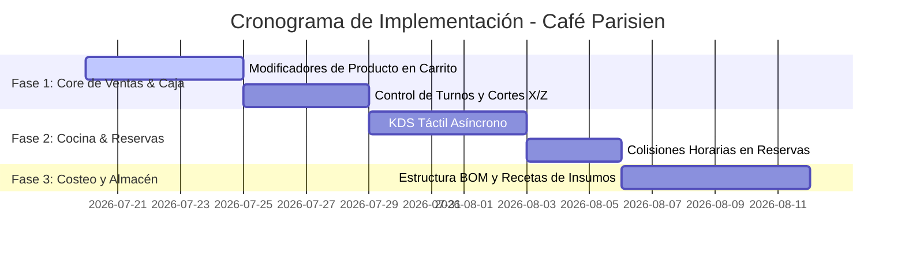

# Plan Maestro de Desarrollo: Café Parisien

Este archivo representa el plan de desarrollo unificado para implementar las mejoras operativas críticas y de negocio identificadas durante las auditorías previas de la cafetería.

## Estructura del Plan y Tareas por Carpeta

Para mantener un orden de desarrollo profesional, las especificaciones de tareas, asignación de responsables y casos de uso seleccionados se encuentran estructurados en la carpeta `Plan_Desarrollo/`:

1. 📂 **[Plan_Desarrollo/](file:///C:/XD/Examen-de-programacion/CafeteriaLaravel/Plan_Desarrollo)**: Directorio contenedor de la planificación.
2. 📄 **[plan_fase_1.md](file:///C:/XD/Examen-de-programacion/CafeteriaLaravel/Plan_Desarrollo/plan_fase_1.md)**: Implementación de modificadores de producto en el checkout y control financiero básico de caja (Corte X y Z). **[Prioridad: Inmediata]**.
3. 📄 **[plan_fase_2.md](file:///C:/XD/Examen-de-programacion/CafeteriaLaravel/Plan_Desarrollo/plan_fase_2.md)**: Módulo KDS interactivo para barras de baristas y cocinas más el control inteligente de colisión de reservaciones. **[Prioridad: Alta]**.
4. 📄 **[plan_fase_3.md](file:///C:/XD/Examen-de-programacion/CafeteriaLaravel/Plan_Desarrollo/plan_fase_3.md)**: Desglose de recetas (BOM) y consumo de materias primas por porción. **[Prioridad: Media]**.

---

## Resumen General de la Planificación y Casos de Uso Faltantes

El sistema actual de Café Parisien posee un excelente esquema de base de datos relacional en MySQL. No obstante, no hay interfaces fluidas en el front-end ni automatizaciones en el backend para utilizarlas. Nuestro plan se enfoca en dotar a estas tablas de la lógica de negocio requerida.

---

## Principios Técnicos a Mantener durante el Desarrollo
* **Arquitectura de Base de Datos Limpia**: No crear nuevas tablas si ya existen en el esquema (ej: utilizar `tiposmodificador` y `opcionesmodificador` en lugar de crear campos de texto sueltos).
* **Consistencia UX/UI**: Emplear los estilos definidos en `app.css` (colores azul marino `#2F4858` y acentos dorados/arena `#C4A484`) con estados de carga (spinners) en todas las llamadas asíncronas AJAX.
* **Seguridad y Auditoría**: Registrar cada acción administrativa en la tabla `logsauditoria` usando el middleware de auditoría del sistema.
